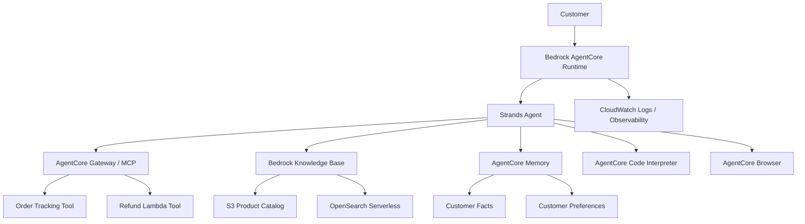

# AWS AgentCore Customer Support Agent

A production-oriented customer support AI agent built with **Amazon Bedrock AgentCore**, **Strands Agents**, **Amazon Bedrock Knowledge Bases**, **AgentCore Memory**, **AgentCore Code Interpreter**, **AgentCore Browser**, **AWS Lambda**, and **MCP Gateway**.

This project was completed as part of the **Udacity AWS AI Engineering Nanodegree** and extends the starter implementation into an end-to-end agent capable of retrieval, tool use, persistent memory, deterministic calculations, live browsing, and cloud deployment.

---

## What the Agent Can Do

- Track customer orders through Gateway-exposed backend tools
- Initiate refunds through AWS Lambda
- Answer product and loyalty questions using Retrieval-Augmented Generation (RAG)
- Remember customer facts and preferences across sessions
- Calculate loyalty discounts with deterministic Python execution
- Retrieve live webpage information through AgentCore Browser
- Run as a deployed Bedrock AgentCore Runtime
- Produce CloudWatch runtime evidence for tool execution and failures

---

## Architecture



---

## Core AWS Services

| Service | Purpose |
|---|---|
| Amazon Bedrock AgentCore Runtime | Hosts and runs the deployed support agent |
| AgentCore Gateway | Exposes backend tools over MCP |
| AWS Lambda | Implements refund and support backend operations |
| Amazon Bedrock Knowledge Bases | Provides RAG over the product catalog |
| Amazon OpenSearch Serverless | Vector store for the Knowledge Base |
| Amazon S3 | Stores product catalog source data |
| AgentCore Memory | Persists facts and customer preferences across sessions |
| AgentCore Code Interpreter | Executes deterministic loyalty calculations |
| AgentCore Browser | Retrieves live webpage information |
| Amazon CloudWatch | Captures runtime logs and operational evidence |

---

## Implementation Highlights

### Gateway Tool Integration

The agent loads backend tools through an **MCPClient** connected to Amazon Bedrock AgentCore Gateway.

The support workflow includes separate tools for:

- order lookup and tracking
- refund initiation

This keeps operational actions outside the language model and allows backend capabilities to be governed independently.

### Retrieval-Augmented Generation

The `search_knowledge_base()` tool uses the Bedrock Knowledge Base **Retrieve API** to answer product, returns, and loyalty questions from a managed product catalog instead of relying on foundation-model memory.

### Cross-Session Customer Memory

A custom `MemoryHook` retrieves long-term customer context before an agent turn and persists the completed interaction afterward.

The implementation distinguishes **historical customer context** from the **current user request** so previously stored memories do not override the active query.

### Deterministic Loyalty Calculations

Loyalty calculations are executed with **AgentCore Code Interpreter** rather than delegated to model arithmetic.

The calculation returns structured values including:

- points redeemed
- points discount
- loyalty tier discount
- total savings
- final order total
- points earned
- remaining points

A fallback path is included for environments where Code Interpreter is unavailable.

### Live Browser Retrieval

The agent integrates **AgentCore Browser** for live web access.

For the page-title scenario, the runtime performs a live browser session and returns the retrieved document title rather than inferring it from model knowledge.

---

## Functional Test Coverage

The final implementation was validated against six end-to-end scenarios.

| Test | Capability | Result |
|---|---|---|
| 1 | Order tracking | Pass |
| 2 | Refund processing | Pass |
| 3 | Knowledge Base / RAG | Pass |
| 4 | Cross-session memory | Pass |
| 5 | Loyalty calculation / Code Interpreter | Pass |
| 6 | Live Browser retrieval | Pass |

Representative validated behaviors include:

- `ORD-001` returns shipping status, UPS carrier, tracking number, and estimated delivery
- `ORD-002` supports the approved refund workflow
- Platinum loyalty returns same-day shipping, 15% discount, and priority support
- Customer memory recalls the user's name and response preference across sessions
- Gold loyalty calculations return deterministic points and discount values
- Amazon page title retrieval uses a live AgentCore Browser session

---

## Project Structure

```text
.
├── main.py
├── product_catalog.txt
├── pyproject.toml
├── uv.lock
├── lambda/
│   ├── lambda_schema
│   ├── order_tracker.py
│   └── refund_processor.py
└── README.md
```

Generated deployment artifacts, local virtual environments, temporary diagnostics, and sandbox-specific AgentCore metadata are intentionally excluded from version control.

---

## Prerequisites

- Python 3.13+
- `uv`
- AWS CLI
- Amazon Bedrock access
- Amazon Bedrock AgentCore access
- AgentCore CLI
- Access to Amazon Nova Lite in `us-east-1`

---

## Installation

Install the project dependencies with:

```bash
uv sync
```

---

## Running Locally

Run the application with:

```bash
uv run python main.py
```

---

## Deployment

Configure AgentCore:

```bash
agentcore configure
```

Deploy the application:

```bash
agentcore deploy
```

Invoke the deployed runtime:

```bash
agentcore invoke '{
  "prompt": "Can you track order ORD-001?",
  "customer_id": "CUST-123",
  "session_id": "demo-1"
}'
```

> AWS resource identifiers and sandbox-specific deployment metadata are intentionally not committed to this repository.

---

## Example Test Scenarios

### Order Tracking

```bash
agentcore invoke '{
  "prompt": "Can you track order ORD-001?",
  "customer_id": "CUST-123",
  "session_id": "t1"
}'
```

### Refund Processing

```bash
agentcore invoke '{
  "prompt": "I want to return my Kindle Paperwhite (ORD-002). Please initiate a refund.",
  "customer_id": "CUST-123",
  "session_id": "t2"
}'
```

### Knowledge Base

```bash
agentcore invoke '{
  "prompt": "What are the benefits of the Platinum loyalty tier?",
  "customer_id": "CUST-123",
  "session_id": "t3"
}'
```

### Long-Term Memory

First session:

```bash
agentcore invoke '{
  "prompt": "Hi, I am Jane. I prefer concise responses.",
  "customer_id": "CUST-123",
  "session_id": "s-A"
}'
```

Later session:

```bash
agentcore invoke '{
  "prompt": "Do you remember my name and communication preference?",
  "customer_id": "CUST-123",
  "session_id": "s-B"
}'
```

### Loyalty Calculation

```bash
agentcore invoke '{
  "prompt": "I am a Gold member with 4250 points. Calculate my discount on a $150 standard order.",
  "customer_id": "CUST-123",
  "session_id": "t5"
}'
```

### Browser Retrieval

```bash
agentcore invoke '{
  "prompt": "Go to https://www.amazon.com and tell me the page title.",
  "customer_id": "CUST-123",
  "session_id": "t6"
}'
```

---

## Key Design Decisions

### Deterministic Calculations

Exact loyalty arithmetic is executed through **AgentCore Code Interpreter** instead of relying on the language model to perform calculations.

This makes the calculation:

- reproducible
- auditable
- easier to test
- less susceptible to arithmetic drift

### Tool-Backed Business Actions

Order tracking and refund processing are implemented as external tools rather than embedded directly in prompts.

This separates:

- reasoning
- business logic
- external actions

and makes each capability easier to secure and evolve independently.

### RAG for Product Knowledge

Product and loyalty information is retrieved from a managed Knowledge Base rather than relying on the foundation model's internal knowledge.

This allows support information to be updated independently of the model.

### Historical Memory vs Current Intent

Long-term customer context is treated as background information.

The current customer message always takes priority so older memories do not accidentally trigger unrelated tools or override the active request.

### Live Browser Data

Current webpage information is retrieved through AgentCore Browser instead of being inferred from model knowledge.

---

## Observability

The deployed runtime integrates with **Amazon CloudWatch** for operational visibility.

Runtime logging can be used to inspect:

- Gateway tool invocation
- Knowledge Base retrieval
- memory operations
- Code Interpreter execution
- Browser execution
- application errors
- tool latency and failures

Representative runtime evidence includes successful execution of:

```text
ordertracker___get_order_by_id
refundprocessor___initiate_refund
search_knowledge_base
CODE_INTERPRETER_SUCCESS
BROWSER_DIRECT_SUCCESS
```

---

## Production Considerations

The implementation was built in a constrained training sandbox.

A production deployment should additionally include:

- authenticated Gateway access
- least-privilege IAM policies
- centralized secret management
- credential rotation
- structured response validation
- CloudWatch metrics and alarms
- distributed tracing where supported
- retry and timeout policies
- circuit breakers
- request-level cost controls
- PII handling controls
- data-retention policies
- automated integration tests
- regression testing
- security and penetration testing
- CI/CD deployment pipelines

---

## Security Considerations

Environment-specific AWS metadata is excluded from version control.

The repository does not intentionally include:

- AWS access keys
- AWS secret access keys
- AWS session tokens
- local virtual environments
- generated AgentCore deployment packages
- temporary debugging logs
- sandbox-specific AgentCore configuration

The following are ignored through `.gitignore`:

```text
.venv/
__pycache__/
*.pyc
.env
.env.*
*.log
.bedrock_agentcore/
.bedrock_agentcore.yaml
```

---

## Skills Demonstrated

This project demonstrates practical experience with:

- AI agent architecture
- Amazon Bedrock
- Amazon Bedrock AgentCore
- Strands Agents
- MCP
- serverless backend integration
- AWS Lambda
- Retrieval-Augmented Generation
- vector search
- OpenSearch Serverless
- persistent agent memory
- deterministic tool execution
- browser automation
- cloud deployment
- CloudWatch observability
- IAM and security considerations
- production AI system design

---

## Course Context

Built as part of the **Udacity AWS AI Engineering Nanodegree — Course 2** project focused on building production-grade customer support agents with Amazon Bedrock AgentCore.

This repository contains my completed implementation and project-specific engineering decisions.

The original Udacity starter instructions, reference solution, and grading rubric are not reproduced here.

---

## License

This repository is intended for educational and portfolio use.

Third-party services, SDKs, course materials, and trademarks remain subject to their respective licenses and terms.
